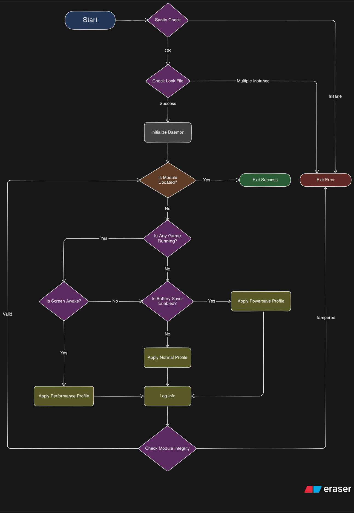

# Flux Tweaks Daemon

This is the core of Flux Tweaks that handles automatic profiles, configs and addons.

Before you digging into this code thinking this is some kind of scheduling module like Uperf, it's not. Flux Tweaks is a profile-style performance module, it simply applies performance tweaks as profiles and  <ins>do not dynamically control the scheduling and frequencies</ins>.

Flux Tweaks works by using information such as:
- Currently running app
- Screen state, whenever it's awake or not and...
- Battery saver state (yes the ones on your quick settings)

## Workflow diagram

